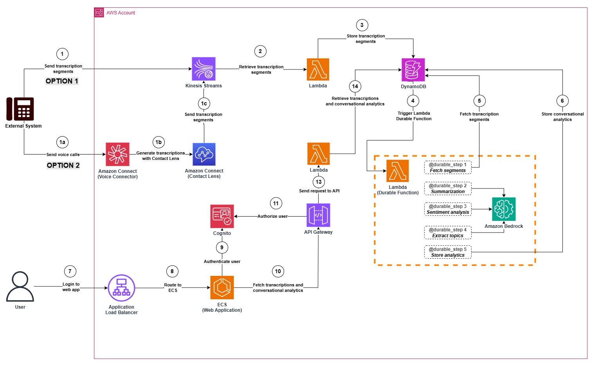
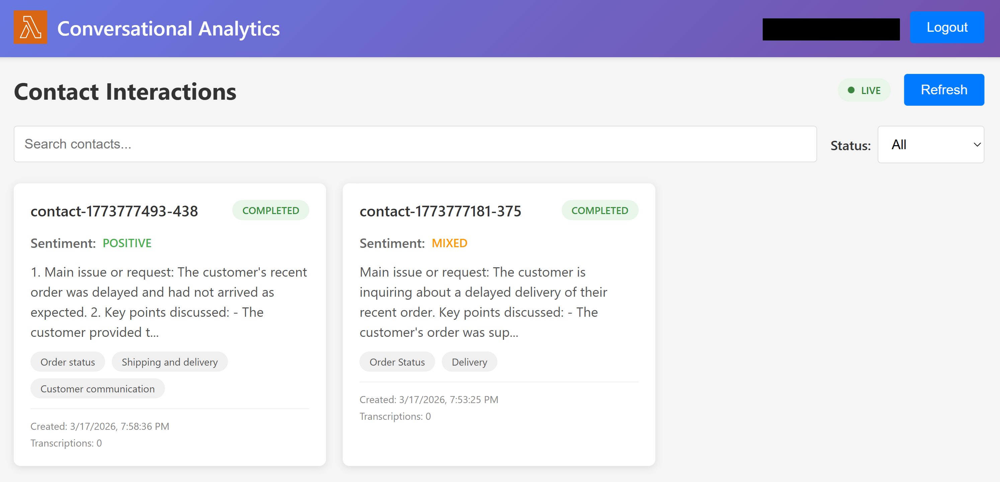
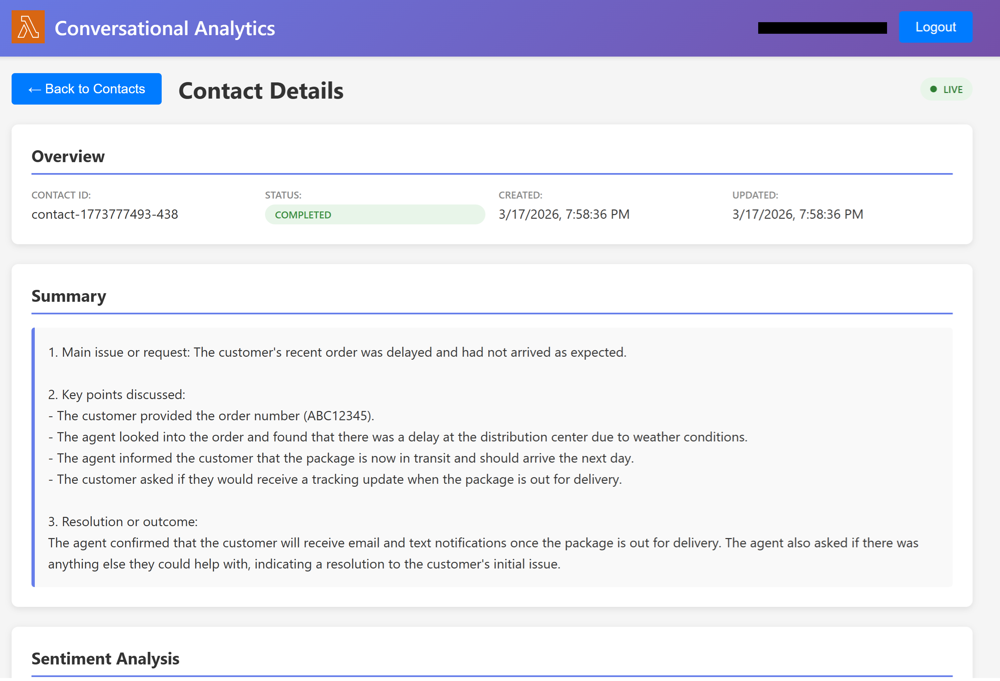

# Serverless Conversational Analytics (SCA)

A comprehensive serverless solution for processing voice call transcriptions from contact centers, performing AI-powered conversational analytics, and delivering real-time insights through a web application.



## Architecture Overview

The SCA solution leverages AWS serverless services to provide:

- **Real-time transcription processing** via Kinesis Streams and Lambda
- **AI-powered analytics** using Amazon Bedrock for sentiment analysis, topic extraction, and summarization
- **Secure web application** with Cognito authentication, deployed on ECS with private ALB
- **Optional CloudFront access** via CloudFront distribution

## Project Structure

```
sca-solution/
├── infrastructure/          # AWS CDK infrastructure code (TypeScript)
│   ├── lib/                # CDK stack definitions
│   ├── bin/                # CDK app entry point
│   └── test/               # Infrastructure tests
├── backend/                # Lambda function source code (Python)
│   ├── transcription-processor/  # Kinesis Stream consumer
│   ├── analytics-processor/      # DynamoDB Streams consumer
│   ├── data-retrieval/           # Query APIs
│   └── shared/                   # Common utilities and types
├── frontend/               # React web application (TypeScript)
│   ├── src/                # React source code
│   ├── public/             # Static assets
│   └── Dockerfile          # Container configuration
└── diagrams/               # Solution diagram and UX samples
```

## Technology Stack

### Infrastructure & Deployment
- **Infrastructure as Code**: AWS CDK with TypeScript
- **Cloud Platform**: AWS (serverless architecture)
- **Container Registry**: Amazon ECR for web application images
- **Compute**: AWS Lambda (Python), Amazon ECS (containerized React app)
- **Networking**: VPC with private subnets (public subnets added only when CloudFront is deployed), ALB, optional CloudFront

### Backend Services
- **Runtime**: Python for Lambda functions
- **Data Streaming**: Amazon Kinesis Streams
- **Database**: Amazon DynamoDB with DynamoDB Streams
- **AI/ML Services**: Amazon Bedrock (sentiment analysis, topic extraction, summarization)
- **Authentication**: Amazon Cognito User Pool
- **Error Handling**: SQS Dead Letter Queues

### Frontend
- **Framework**: React with TypeScript
- **Containerization**: Docker with ECR deployment
- **Hosting**: Amazon ECS with private ALB

## Getting Started

### Prerequisites

- Node.js 18+ and npm
- AWS CLI configured with appropriate permissions
- Docker (for frontend containerization)
- Python 3.9+ (for Lambda functions)

### Installation

1. **Install dependencies**:
   ```bash
   npm install
   ```

2. **Build the project**:
   ```bash
   npm run build
   ```

3. **Bootstrap CDK** (first time only):
   ```bash
   cdk bootstrap
   ```
   
   This sets up the necessary AWS resources for CDK deployments in your account/region.

### Lambda Function Packaging

Lambda functions are automatically packaged and deployed by AWS CDK during stack deployment. No manual packaging is required.

**How it works:**
- CDK uses `lambda.Code.fromAsset()` to bundle Python code from the `backend/` directories
- Dependencies listed in each function's `requirements.txt` are automatically installed during deployment
- CDK creates deployment packages and uploads them to S3
- Lambda functions are updated with the new code

**Python dependencies are handled automatically** - you don't need to run `pip install` locally for Lambda functions. CDK manages this during the `cdk deploy` process.

**Note:** If you want to run Lambda function tests locally, install dependencies in each backend directory:
```bash
(cd backend/transcription-processor; pip install -r requirements.txt)
```

### Deployment

**Quick Start:**

1. **Deploy network infrastructure**:
   ```bash
   cdk deploy ScaNetworkStack
   ```

2. **Deploy backend services** (Kinesis, DynamoDB, Lambda, API Gateway, Cognito):
   ```bash
   cdk deploy ScaBackendStack
   ```

3. **Deploy ECR repository**:
   ```bash
   cdk deploy ScaEcrStack
   ```

4. **Build and deploy container image**:
   
   After backend is deployed, build and push the React application container with Cognito configuration:
   
   ```bash
   chmod +x scripts/deploy-container.sh
   bash ./scripts/deploy-container.sh us-west-2
   ```
   
   Note: Replace `us-west-2` with your deployment region.
   
   The script will:
   - Fetch Cognito configuration from ScaBackendStack
   - Build the Docker image with environment variables
   - Push the image to Amazon ECR

5. **Deploy web application** (ECS, ALB):
   ```bash
   cdk deploy ScaWebAppStack
   ```

6. **Set up test user**:
   
   Create a test user and send temporary password via email:
   
   ```bash
   chmod +x scripts/setup-test-user.sh
   ./scripts/setup-test-user.sh "your-email@example.com"
   ```
   
   The script will:
   - Create a user with your email as the username
   - Add the user to the Analysts group
   - Send a temporary password to the provided email address

7. **Deploy CloudFront Access stack (optional)** (adds public subnets, NAT Gateway, and CloudFront)

   Note: You can use this stack to allow access to the web application from a public endpoint using Amazon CloudFront. This can be used if you currently cannot access a web application behind a private ALB with an existing private connection (VPN, Direct Connect, etc.).
   
   ```bash
   cdk deploy ScaCloudFrontAccessStack -c enableCloudFrontAccess=true
   ```

8. **Deploy Amazon Connect instance** (Amazon Connect is used to initiate voice calls and generate transcriptions):
   ```bash
   cdk deploy ScaConnectStack -c enableConnect=true
   ```
   
   This creates an Amazon Connect instance with:
   - Contact flow configured for call transcription
   - Integration with Kinesis Stream for real-time transcription ingestion
   - Phone number for testing
   - Admin credentials stored in Secrets Manager
   
   **Note**: If the deployment fails with a phone number error (e.g., "Phone number not found: +1XXXXXXXXXX"), try to redeploy the ScaConnectStack. If the issue persists, please review the logs to troubleshoot.

### Place a phone call

1. **Retrieve the phone number** to test a live call transcription:

```bash
aws cloudformation describe-stacks --stack-name ScaConnectStack --query 'Stacks[0].Outputs[?OutputKey==`PhoneNumberE164`].OutputValue' --output text
```

2. **Call the phone number** displayed to test the solution. Your call will be transcribed in real-time and processed through the analytics pipeline.

3. **Login to Amazon Connect** as a support agent to receive the call:
   
   - Get the Connect login URL:
   ```bash
   aws cloudformation describe-stacks --stack-name ScaConnectStack --query 'Stacks[0].Outputs[?OutputKey==`ConnectLoginUrl`].OutputValue' --output text
   ```
   
   - Get the admin credentials:
   ```bash
   aws cloudformation describe-stacks --stack-name ScaConnectStack --query 'Stacks[0].Outputs[?OutputKey==`GetCredentialsCommand`].OutputValue' --output text | bash
   ```
   
   - Navigate to the Connect login URL
   - Login with username `admin` and the password from the command above
   - Select **Connect Workspace**, then select **Contact Control Panel**
   - Set your status to "Available" in the Contact Control Panel (CCP)

4. **Answer the incoming call in Amazon Connect** as a support agent to receive the call:

   - Answer the incoming call to start the transcription process
   - Toggle mute on/off to simulate a back-and-forth conversation
   - Speak when unmuted, and mute yourself to let the caller speak

5. **Close the contact in Amazon Connect**:

   - Select **Close contact** in Amazon Connect

### Ingest sample transcriptions (without Amazon Connect)

You can test the analytics pipeline without Amazon Connect by ingesting sample transcription segments directly into the Kinesis Data Stream:

```bash
chmod +x scripts/ingest-transcriptions.sh
./scripts/ingest-transcriptions.sh
```

You can also provide a custom contact ID:

```bash
./scripts/ingest-transcriptions.sh my-test-contact-001
```

The script retrieves the Kinesis stream name from the ScaBackendStack outputs and sends a sample customer support conversation (6 segments + completion event). This triggers the full pipeline: transcription storage, sentiment analysis, topic extraction, and summarization.

### Accessing the Application

1a. **Private Access (Default):**
The application is deployed behind a private ALB. Access it from within the VPC using the ALB DNS name:

```bash
aws cloudformation describe-stacks --stack-name ScaWebAppStack --query 'Stacks[0].Outputs[?OutputKey==`AlbDnsName`].OutputValue' --output text
```

Navigate to `http://<ALB-DNS-NAME>` from within the VPC.

1b. **Public Access (Optional):**
If you deployed the CloudFront access stack, access via the CloudFront distribution URL:

```bash
aws cloudformation describe-stacks --stack-name ScaCloudFrontAccessStack --query 'Stacks[0].Outputs[?OutputKey==`CloudFrontUrl`].OutputValue' --output text
```

2. Login to the web application

Enter your login (email address specified in Step 6) and the temporary password received in your email address.

You will be asked to enter a new password. Once done, you will get access to the web application (sample below).




## Additional Configuration for private deployment

### VPN Access
Configure allowed CIDR blocks for private access by setting the CDK context:

```bash
cdk deploy -c allowedCidrBlocks='["10.0.0.0/8","192.168.0.0/16"]'
```

## Security Validation with CDK Nag

The project includes CDK Nag to automatically validate infrastructure against AWS best practices and security standards.

### What CDK Nag Checks

- AWS Solutions best practices
- Security configurations (encryption, IAM policies, network security)
- Compliance with AWS Well-Architected Framework
- Common misconfigurations and anti-patterns

### Running CDK Nag

CDK Nag runs automatically during synthesis and deployment:

```bash
# Validate during synthesis
npm run synth

# Validate during deployment
npm run deploy
```

Warnings and errors will be displayed in the output with rule IDs and remediation guidance.

### Viewing All Findings

To see all CDK Nag findings:

```bash
npm run synth 2>&1 | grep "AwsSolutions"
```

### Suppressing Specific Rules

If you need to suppress a specific CDK Nag rule (with proper justification), add a suppression in your stack:

```typescript
import { NagSuppressions } from 'cdk-nag';

// Suppress for a specific resource
NagSuppressions.addResourceSuppressions(myResource, [
  {
    id: 'AwsSolutions-IAM4',
    reason: 'AWS managed policy is appropriate for this Lambda execution role',
  },
]);

// Suppress for an entire stack
NagSuppressions.addStackSuppressions(this, [
  {
    id: 'AwsSolutions-L1',
    reason: 'Using Python 3.13 which is the latest runtime',
  },
]);
```

### Common CDK Nag Rules

- **AwsSolutions-IAM4**: AWS managed policies (consider custom policies for least privilege)
- **AwsSolutions-IAM5**: Wildcard permissions in IAM policies
- **AwsSolutions-L1**: Lambda runtime version
- **AwsSolutions-S1**: S3 bucket access logging
- **AwsSolutions-CFR4**: CloudFront distribution uses custom SSL certificate

## Cleanup

To tear down all deployed resources, destroy the stacks in reverse dependency order:

```bash
# If you deployed the optional CloudFront access stack
cdk destroy ScaCloudFrontAccessStack -c enableCloudFrontAccess=true

# If you deployed the optional Connect integration stack
cdk destroy ScaConnectStack -c enableConnect=true

# Core stacks (order matters)
cdk destroy ScaWebAppStack
cdk destroy ScaEcrStack
cdk destroy ScaBackendStack
cdk destroy ScaNetworkStack
```

Or destroy all stacks at once (CDK resolves the dependency order automatically):

```bash
cdk destroy --all
```

> **Note:** If you deployed optional stacks with context flags, include them so CDK can resolve the stack definitions:
> `cdk destroy --all -c enableCloudFrontAccess=true -c enableConnect=true`

## Security

See [CONTRIBUTING](CONTRIBUTING.md#security-issue-notifications) for more information.

## License

This library is licensed under the MIT-0 License. See the LICENSE file.

